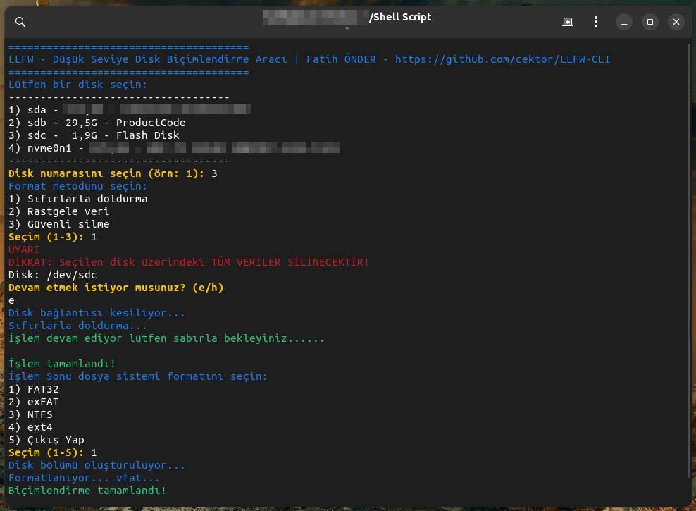

<a href="#">
    
</a>


# LLFW-CLI
LLFW (Low-Level Formatter Wizard) is a command line tool that facilitates low-level formatting operations for disks. It supports disk selection, data sanitization methods (zero fill, random data, secure erase) and FAT32, exFAT, NTFS, ext4 formatting. It requires root privileges and warns that all data will be deleted.

NOTE: LLFW GUI Graphical Visual User Interface Version Available: https://github.com/cektor/LLFW/


# Danger
This permanently erases all data on your disk and makes it unrecoverable. So Make Sure You Choose the Right Disk!

# LLFW Linux Screenshot
  
----------------------------------

# Usage:
You can use the script by running it from a terminal.
You must have root (administrator) privileges for the script to work properly. Therefore, you need to run the script with the sudo command.

# Fast Download and Run
```bash
sudo apt install git -y && git clone https://github.com/cektor/LLFW-CLI.git && cd LLFW-CLI && sudo chmod +x LLFW.sh && sudo ./LLFW.sh
```


# Install Git Clone 

Github Package Must Be Installed On Your Device.
```bash
sudo apt install git  -y
```
----------------------------------

# Compile
 
```bash
sudo git clone https://github.com/cektor/LLFW-CLI.git
```
```bash
cd BreadcrumbsLLFW-CLI/

```
```bash
sudo chmod +x LLFW.sh
```
```bash
sudo ./LLFW.sh
```
